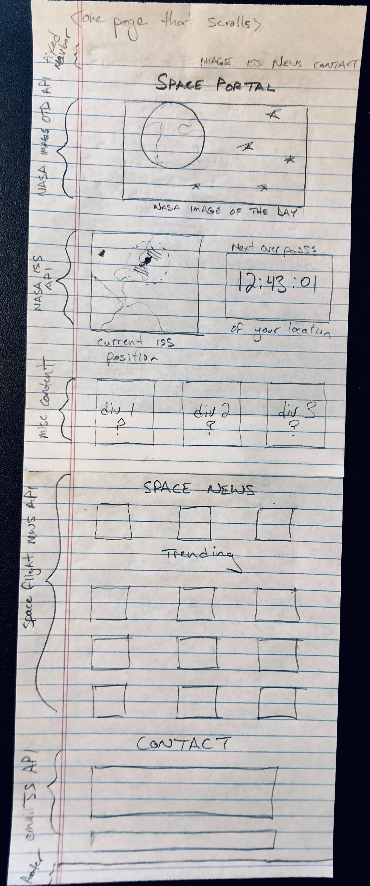

# Space Portal

This project is a sleek dashboard for important space-related activity
 
## UX

The site has a space feel to it, it uses orbitron font and has a color scheme and background image that is space focused

### User Stories
 
- As a space enthusiast, I want to know where the ISS is, so I can track it
- As a Satellite vendor, I want to get the most updated news stories to see what is happening in the industry
- As a blogger and former astronaut, I want to be able to email the creators of Space Portal to recommend content they should add to their website 

### Wireframe

### Page Features

- Bootstrap styling
- NASA Astronomy Picture of the Day (NASA Open API)
- Moving map of ISS location (NASA Open API)
- Embedded youtube video of ISS view - can use to also verify position (Youtube)
- News Feed (newsapi.org)
- Contact Us (EmailJS)
 
### Features Left to Implement

- Calculate the next time the ISS will pass overhead based on user position
- Graph the orbital inclination of the ISS and graph it in GraphJS
- Be able to search for a variety of satellites and see their position
- Be able to display news article image tiles with the associated article
- Allow users to search for their own news articles with a Space News search bar

## Technologies Used

- HTML 
    - The project uses HTML to render the page in the browser
- [CSS](https://stackpath.bootstrapcdn.com)  
    - The project uses CSS to style the pages and uses Bootstrap to improve styling
- Javascript
    - The project uses Javascript to update elements within the HTML document (DOM) and pull data in from external sources
- [JQuery](https://jquery.com)
    - The project uses **JQuery** to simplify DOM manipulation.
- [Leaflet](https://leafletjs.com)
    - The project uses leaflet to render a map, place the users location, and plot the ISS icon, and display live location of the ISS (5s refresh rate)
- [emailJS](https://emailjs.com)
    - The project uses emailJS to enable users to submit inquiries directly from the page
- [News](https://newsapi.org)
    - The project uses the newsapi.org API to pull in news articles with the keyword "space"
- [ISS-position](http://open-notify.org)
    - The project uses the open-notify.org API to pull in ISS position as well as the number of astronauts currently in space

### Map Choice

- I went with leafletJS over google maps because Google Maps API calls is throttled
- I added the ability to identify an error and console log the respective issues when an API call did not go through

## Testing
- Used console log in javascript code to indicate when successful email response received from emailjs server
- Code will tell user that there are no news stories when the query does not yield any article results
- Tested the site by clicking all buttons
    - Sometimes the leaflet.js map tiles would not load
    - Found other bugs that I would fix
- Had a friend and mentor review the code and site
- Discovered that open-notify is served over an HTTP server, which means that I could not test the functionality on gitpod which is served on a HTTPS server due to the same origin policy issue. As such I had to move the repo to my local, and use Atom to iterate on the site. 

## Deployment
To run the project locally, you should just have to download all the files, place the root in the same folder, or clone the repo to you local. Open index.html and the site should render in your default browser.

In order to get the site live, I had to obtain a custom domain from go-daddy.com to avoid the same origin policy issue.

## Credits

### Content
- The NASA Astronomy Picture of the Day content is pulled from NASA's API, and the image creator is recognized on the page 
- The Leaflet map widget was created by using the documentation on the leafletjs page
- The ISS position and astronaut information was taken from the documentation on open-notify.org
- The space news feed list was generated via the documentation on the newsapi.org page
- The contact form and emailJS hookup was taken from the emailJS documentation as well as previous work in this module

### Media
- The photos used in this site were obtained from Unsplash
    - The background image was taken by: Ivana Cajina 

### Acknowledgements

- I'd like to thank my mentor for his feedback
- Code institute for slightly extending the deadline
- My company Slingshot Aerospace for getting me obsessed with space
